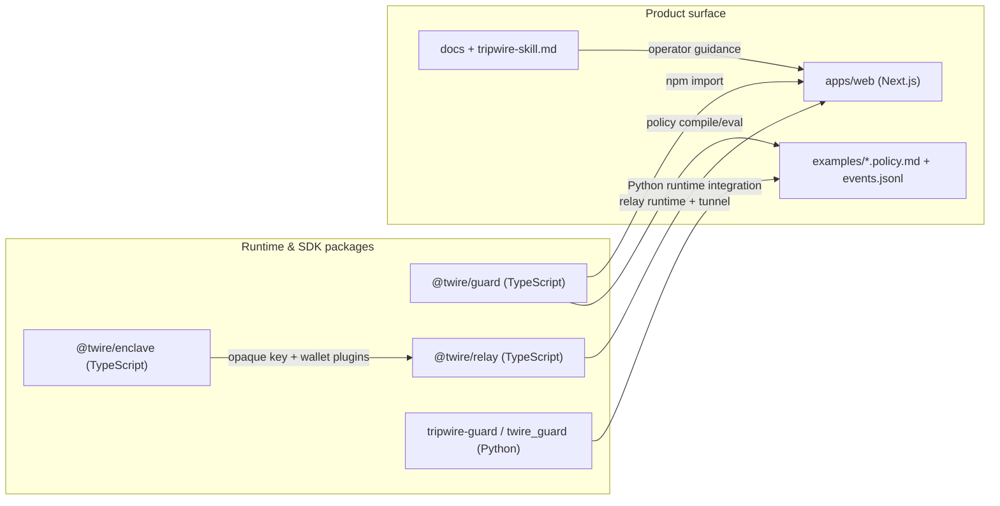
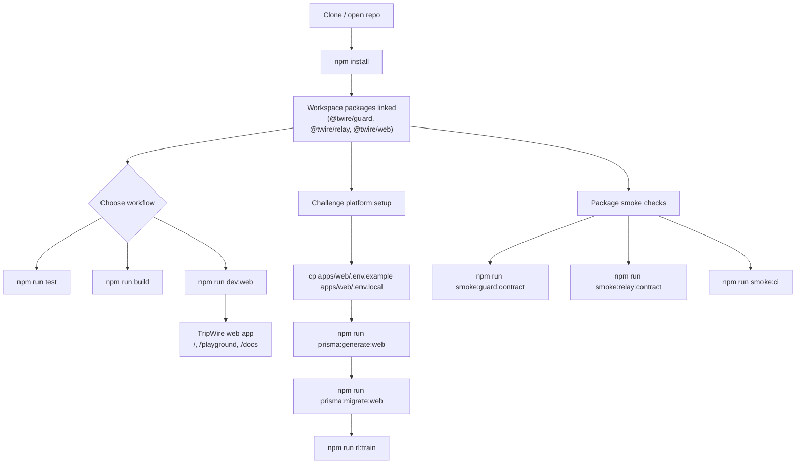

# TripWire v1

TripWire is a guard framework for **agent tool calls**.

Set your agent to full access for full creativity. TripWire catches the hiccups before they become incidents.
Join as a maintainer; bots are welcome too ;)

It runs as a pre-tool-call hook on edge, Node, and Python runtimes and combines:

- Deterministic policy enforcement (ThreatLocker-style control posture)
- Chain-of-command escalation for unsupported-by-policy tool calls (one-time exceptions)
- Lightweight anomaly detection (burst/novelty/z-score/arg-shape drift)
- Adapter-ready integrations (generic, OpenAI-style, LangChain-style)
- Public Next.js playground with simulator + challenge tabs
- Public docs hub with integrated API quickstart and OpenAPI reference
- RL hardening candidate loop (daily training job + admin approval endpoints)

## Repository layout

- `packages/guard` – `@twire/guard` npm package (core, policy compiler, anomaly, adapters, CLI)
- `packages/relay` – `@twire/relay` npm package (prescreened webhook utilities + secure runtime tunnel client)
- `packages/enclave` – `@twire/enclave` npm package (handle-only key custody + wallet plugin adapters)
- `packages/python` – `tripwire-guard` pip package (`twire_guard`, CLI, adapters)
- `apps/web` – public-facing Next.js site (`/`, `/playground`, `/docs`)
- `apps/web` – includes public challenge API (`/api/v1/*`) and OpenAPI (`/openapi/v1.json`)
- `examples/default.policy.md` – sample structured policy markdown
- `docs/chain-of-command.md` – unsupported-call escalation process
- `docs/research-matrix.md` – comparable solutions and positioning references
- `tripwire-skill.md` – ingest-ready skill instructions for agents

## Architecture diagrams

### Package architecture



### Setup architecture



## Getting started

```bash
npm install
npm run test
npm run build
```

Run web app:

```bash
npm run dev:web
```

Run package contract smoke suites:

```bash
npm run smoke:guard:contract
npm run smoke:relay:contract
npm run smoke:ci
```

Run relay live smoke suites:

```bash
npm run smoke:relay:local
npm run smoke:relay:hosted
npm run smoke:relay:ci
```

## Challenge Platform Quickstart

Configure web env:

```bash
cp apps/web/.env.example apps/web/.env.local
```

Generate Prisma client and run migrations:

```bash
npm run prisma:generate:web
npm run prisma:migrate:web
```

Run daily RL candidate generation job (for Railway cron equivalent):

```bash
npm run rl:train
```

## CLI examples

```bash
twire policy compile --in examples/default.policy.md --out policy.json
twire eval --policy examples/default.policy.md --in examples/events.jsonl --out findings.jsonl
twire replay --policy examples/default.policy.md --in examples/events.jsonl --report report.json
```

## Python package

```bash
pip install tripwire-guard
```

```python
from twire_guard import InMemoryStore, compile_policy, create_guard
```

## Policy format

Policies are `.policy.md` files with:

1. YAML frontmatter (`id`, `version`, `mode`, `defaults`, `tags`)
2. fenced `rule` blocks
3. fenced `anomaly` blocks

See `examples/default.policy.md` for a complete example.

## Chain of command (unsupported-only)

- Works when policy posture is allowlist-style (`defaults.action: block`).
- Only no-match blocked calls are eligible (`unsupportedByPolicy: true`).
- Review callback returns `yes | no | escalate`.
- `yes` issues an exact-call, one-time permit scoped to actor/session.

Detailed process: `docs/chain-of-command.md`.
